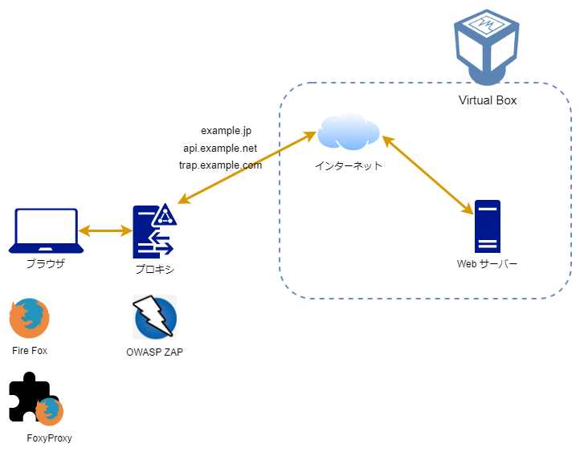
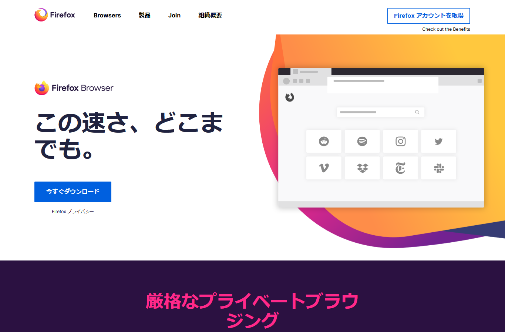
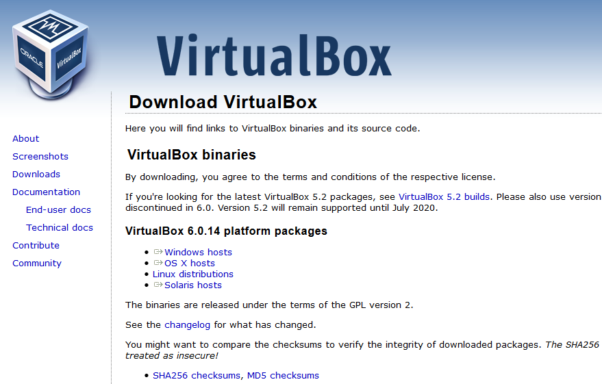
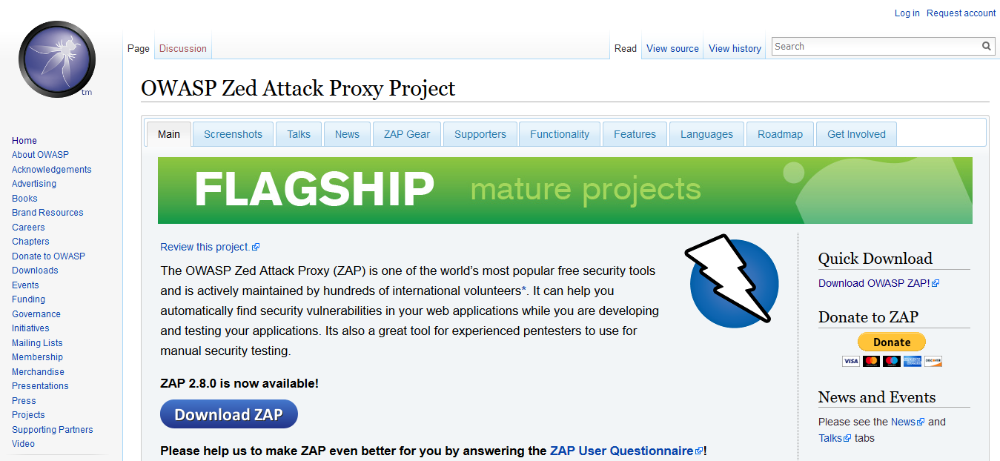
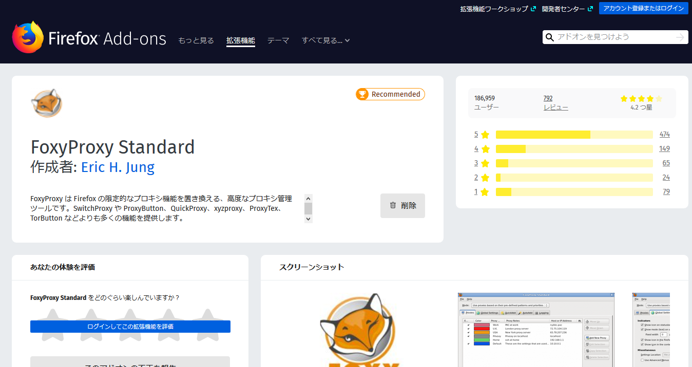
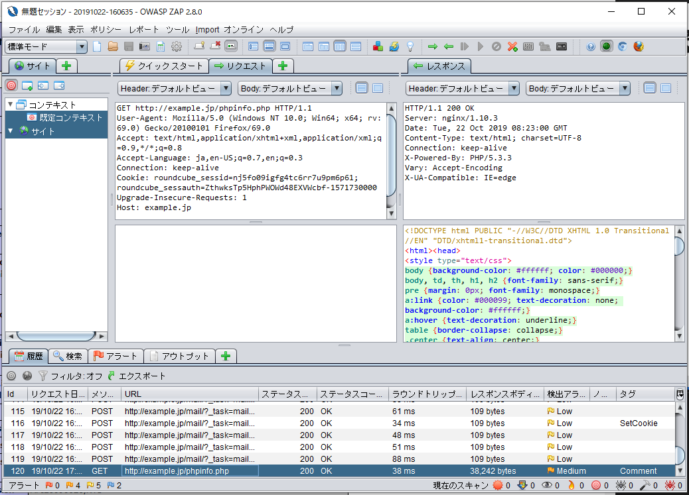
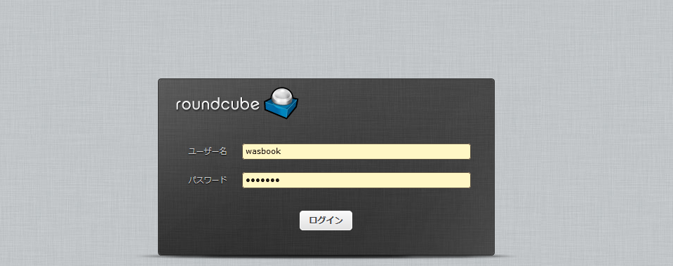

### 安全なWebアプリケーションの作り方
~ 実習環境のセットアップ ~

---

### 実習環境の概要（想定イメージ）

--

### OWASP ZAP とは

- Webアプリケーション脆弱性診断用ツール
- Windows / Mac 上でプロキシとして動作
- HTTP通信の観察、変更が可能

--

### 環境構築手順(p14 - p41)

1. Firefox のインストール
2. VirtualBox のインストール
3. 仮想マシンのインストール & 動作確認
4. OWASP ZAP のインストール
5. FoxyProxy-Standard のインストール
6. OWASP ZAP を使ってみる
7. Web メールの確認

--

### Firefox のインストール

[公式サイト](https://www.mozilla.org/ja/firefox/)

--

### VirtualBox のインストール

[公式サイト](https://www.virtualbox.org/wiki/Downloads)

--

### 仮想マシンのインストール

- [本書ダウンロード元](https://wasbook.org/download/) ※Basic認証必要
  - ID:
  - PW:

--

### OWASP ZAP のインストール

- JRE(Java の実行環境)が必要
  - Mac はデフォルトでインストール済
  - [JRE のダウンロード](https://java.com/ja/download/manual.jsp)
- [OWASP ZAP のダウンロード](https://www.owasp.org/index.php/OWASP_Zed_Attack_Proxy_Project)

--

### Firefoxの拡張FoxyProxy-Standardのインストール

- [FoxyProxy](https://addons.mozilla.org/ja/firefox/addon/foxyproxy-standard/)

--

### OWASP ZAP を使ってみる

--

### Web メールの確認

- [https://example.jp/mail/](https://example.jp/mail/)

